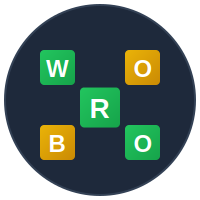

# 🎮 WORBO - Word Guessing Game



**WORBO** is a modern, fast-paced word-guessing game inspired by Wordle. Built with Next.js 15 and Supabase, WORBO challenges players to guess a 5-letter word in 6 attempts while competing on a global leaderboard.

## ✨ Features

- 🎯 **Classic Word Guessing Gameplay** - Guess the 5-letter word in 6 tries
- 🏆 **Global Leaderboard** - Compete with players worldwide and track your ranking
- 🔥 **Streak System** - Build and maintain your winning streak
- 📊 **Performance Tracking** - Monitor your stats, scores, and progress
- 🎨 **Beautiful UI** - Modern, responsive design with smooth animations
- 🔐 **User Authentication** - Secure sign-up and sign-in with Supabase Auth
- 🏅 **Ranking System** - Earn ranks from Unranked to Grande based on your score
- 📱 **Fully Responsive** - Play seamlessly on desktop, tablet, or mobile
- ⚡ **Real-time Updates** - Live leaderboard updates powered by Supabase
- 🎲 **Multiple Categories** - Words from various categories (animals, countries, sports, etc.)

## 🎮 How to Play

1. **Guess the Word**: Enter a valid 5-letter word
2. **Get Feedback**: 
   - 🟩 **Green** - Letter is correct and in the right position
   - 🟨 **Yellow** - Letter is in the word but wrong position
   - ⬜ **Gray** - Letter is not in the word
3. **Win**: Guess the word in 6 tries or less
4. **Score**: Faster guesses and fewer attempts = higher score!

## 🛠️ Tech Stack

- **Framework**: [Next.js 15](https://nextjs.org/) with App Router
- **Language**: [TypeScript](https://www.typescriptlang.org/)
- **Styling**: [Tailwind CSS 4](https://tailwindcss.com/)
- **Database & Auth**: [Supabase](https://supabase.com/)
- **Icons**: [Lucide React](https://lucide.dev/)
- **Fonts**: Geist Sans & Geist Mono
- **Deployment**: [Vercel](https://vercel.com/)

## 📦 Installation

### Prerequisites

- Node.js 18+ installed
- npm, yarn, or pnpm package manager
- Supabase account and project

### 1. Clone the Repository

```bash
git clone https://github.com/yourusername/worbo.git
cd worbo
```

### 2. Install Dependencies

```bash
npm install
# or
yarn install
# or
pnpm install
```

### 3. Set Up Environment Variables

Create a `.env.local` file in the root directory:

```env
# Supabase Configuration
NEXT_PUBLIC_SUPABASE_URL=your_supabase_project_url
NEXT_PUBLIC_SUPABASE_ANON_KEY=your_supabase_anon_key
SUPABASE_SERVICE_ROLE_KEY=your_supabase_service_role_key
```

**Where to find these values:**
1. Go to your [Supabase Dashboard](https://app.supabase.com/)
2. Select your project
3. Navigate to **Settings** → **API**
4. Copy the **Project URL** and **API Keys**

### 4. Set Up Supabase Database

Create the following tables in your Supabase project:

#### `userProfile` Table

```sql
CREATE TABLE userProfile (
  id UUID PRIMARY KEY DEFAULT uuid_generate_v4(),
  user_id UUID REFERENCES auth.users(id) ON DELETE CASCADE,
  username TEXT UNIQUE NOT NULL,
  score INTEGER DEFAULT 0,
  streak INTEGER DEFAULT 0,
  games_played INTEGER DEFAULT 0,
  games_won INTEGER DEFAULT 0,
  created_at TIMESTAMP WITH TIME ZONE DEFAULT NOW(),
  updated_at TIMESTAMP WITH TIME ZONE DEFAULT NOW()
);

-- Enable Row Level Security
ALTER TABLE userProfile ENABLE ROW LEVEL SECURITY;

-- Create policies
CREATE POLICY "Users can view all profiles" ON userProfile
  FOR SELECT USING (true);

CREATE POLICY "Users can update own profile" ON userProfile
  FOR UPDATE USING (auth.uid() = user_id);

CREATE POLICY "Users can insert own profile" ON userProfile
  FOR INSERT WITH CHECK (auth.uid() = user_id);
```

#### `gameHistory` Table (Optional - for tracking game history)

```sql
CREATE TABLE gameHistory (
  id UUID PRIMARY KEY DEFAULT uuid_generate_v4(),
  user_id UUID REFERENCES auth.users(id) ON DELETE CASCADE,
  profile_id UUID REFERENCES userProfile(id) ON DELETE CASCADE,
  word TEXT NOT NULL,
  guesses INTEGER NOT NULL,
  won BOOLEAN NOT NULL,
  score INTEGER NOT NULL,
  time_taken INTEGER, -- in seconds
  category TEXT,
  created_at TIMESTAMP WITH TIME ZONE DEFAULT NOW()
);

-- Enable Row Level Security
ALTER TABLE gameHistory ENABLE ROW LEVEL SECURITY;

-- Create policies
CREATE POLICY "Users can view own game history" ON gameHistory
  FOR SELECT USING (auth.uid() = user_id);

CREATE POLICY "Users can insert own game history" ON gameHistory
  FOR INSERT WITH CHECK (auth.uid() = user_id);
```

### 5. Run the Development Server

```bash
npm run dev
# or
yarn dev
# or
pnpm dev
```

Open [http://localhost:3000](http://localhost:3000) in your browser to see the app.

## 🚀 Deployment

### Deploy to Vercel

The easiest way to deploy WORBO is using [Vercel](https://vercel.com/):

1. Push your code to GitHub
2. Import your repository to Vercel
3. Add your environment variables in Vercel project settings
4. Deploy!

[](https://vercel.com/new/clone?repository-url=https://github.com/yourusername/worbo)

### Build for Production

```bash
npm run build
npm start
```

## 📁 Project Structure

```
worbo/
├── app/
│   ├── api/              # API routes
│   │   └── dictionary/   # Word validation API
│   ├── auth/             # Authentication pages
│   │   ├── signin/       # Sign in page
│   │   ├── signup/       # Sign up page
│   │   └── makeprofile/  # Profile creation
│   ├── game/             # Game pages
│   │   ├── page.tsx      # Main game interface
│   │   └── easymode/     # Easy mode variant
│   ├── leaderboard/      # Leaderboard page
│   ├── menu/             # Menu/settings
│   ├── layout.tsx        # Root layout
│   ├── page.tsx          # Landing page
│   └── globals.css       # Global styles
├── lib/
│   ├── supabaseClient.ts # Supabase client config
│   ├── supabaseAdmin.ts  # Supabase admin config
│   └── getRank.ts        # Ranking system logic
├── public/
│   ├── logo.svg          # App logo
│   └── trophies/         # Rank trophy images
├── next.config.ts        # Next.js configuration
├── tailwind.config.ts    # Tailwind CSS configuration
├── tsconfig.json         # TypeScript configuration
└── package.json          # Dependencies
```

## 🏅 Ranking System

Players earn ranks based on their total score:

| Rank | Score Required | Trophy |
|------|----------------|--------|
| 🏆 Grande | 90,000+ | grande.png |
| 🌊 Abyssal | 90,000+ | abyssal.png |
| 💎 Diamond | 80,000+ | diamond.png |
| 🥈 Platinum | 70,000+ | platinum.png |
| 💚 Emerald | 60,000+ | emerald.png |
| 🥇 Gold | 50,000+ | gold.png |
| 🤍 Pearl | 40,000+ | pearl.png |
| 🟤 Copper | 30,000+ | coper.png |
| ⚫ Iron | 20,000+ | iron.png |
| 🟫 Wood | 10,000+ | wood.png |
| ⚪ Unranked | 0-9,999 | unranked.png |

## 🎯 Game Scoring

Score is calculated based on:
- **Speed**: Faster completion = higher score
- **Attempts**: Fewer guesses = higher score
- **Streak**: Consecutive wins boost your score
- **Category**: Different word categories may have different scoring

## 🔧 Configuration

### Customizing Word Categories

Edit the categories array in `app/game/page.tsx`:

```typescript
const categories = [
  "animals",
  "countries",
  "sports",
  "fruits",
  "colors",
  "vehicles",
  "technology",
  // Add your custom categories
];
```

### Adjusting Game Settings

Modify constants in `app/game/page.tsx`:

```typescript
const WORD_LENGTH = 5;  // Length of words
const MAX_TRIES = 6;    // Maximum attempts
```

## 🤝 Contributing

Contributions are welcome! Please follow these steps:

1. Fork the repository
2. Create a feature branch (`git checkout -b feature/amazing-feature`)
3. Commit your changes (`git commit -m 'Add amazing feature'`)
4. Push to the branch (`git push origin feature/amazing-feature`)
5. Open a Pull Request

## 📝 License

This project is open source and available under the [MIT License](LICENSE).

## 🐛 Known Issues

- None at the moment! Report issues on GitHub.

## 📧 Support

For support, email support@worbo.com or open an issue on GitHub.

## 🙏 Acknowledgments

- Inspired by the original [Wordle](https://www.nytimes.com/games/wordle/index.html) by Josh Wardle
- Built with amazing open-source technologies
- Special thanks to the Next.js and Supabase communities

## 📸 Screenshots

### Landing Page
Beautiful, modern landing page with smooth animations and gradient effects.

### Game Interface
Clean, intuitive game board with real-time feedback and keyboard input.

### Leaderboard
Competitive leaderboard showing top players and their rankings.

---

**Made with ❤️ by the WORBO Team**

*Challenge yourself. Compete globally. Master the word game.*
